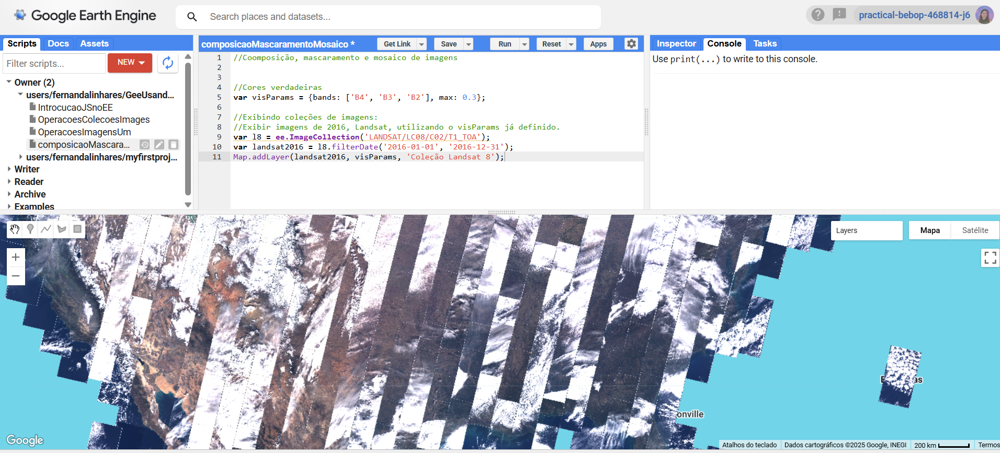
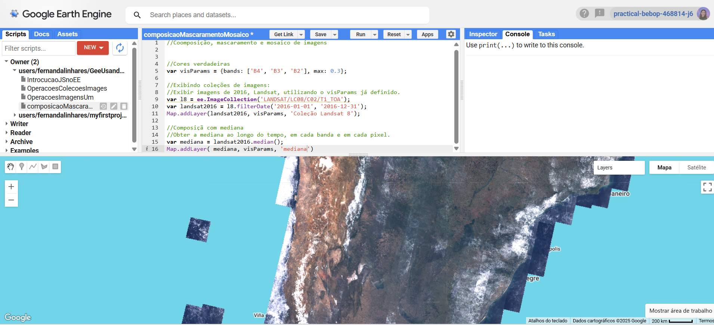
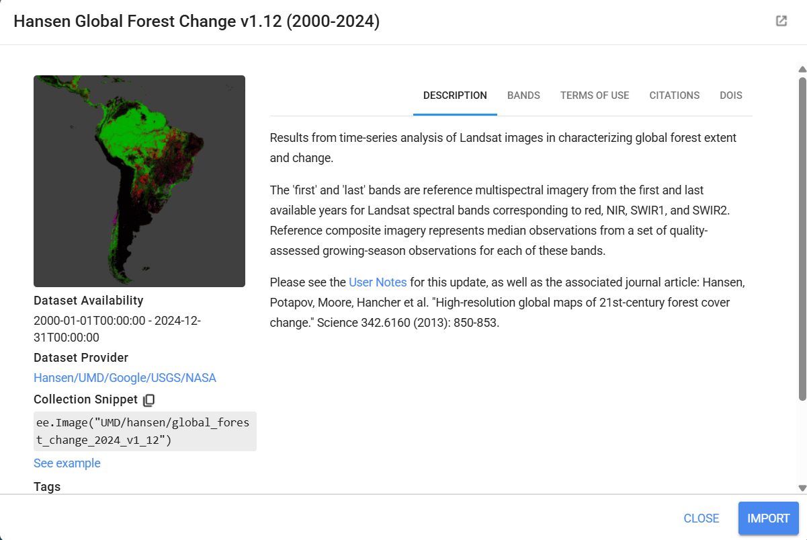
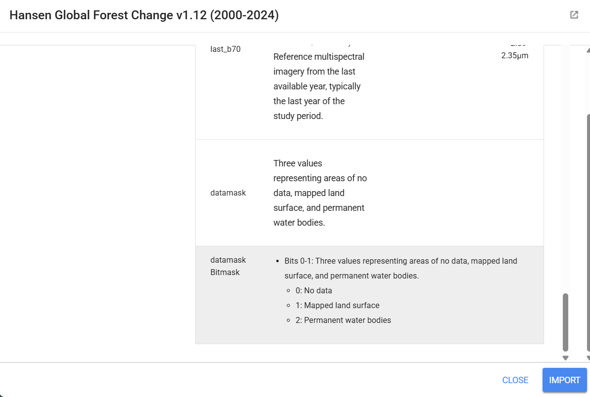
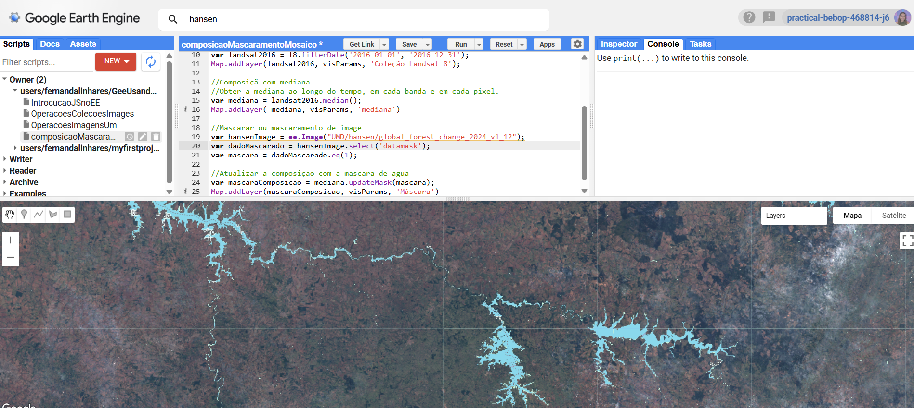

# 🌍 Composição, Mascaramento e Mosaico de Imagens no Google Earth Engine

Este repositório apresenta um exercício desenvolvido na disciplina **Computação em Nuvem**, do curso de **Ciência de Dados Geoespaciais**, utilizando a plataforma **Google Earth Engine (GEE)**.

O exercício tem como objetivo compreender o processamento de imagens de satélite em ambiente de nuvem, explorando **coleções de imagens**, **redução estatística**, **mascaramento** e **composição final de camadas**.

---

## 🛰️ Imagem 1 — Coleção Landsat 8 (Cores Verdadeiras)

Foi utilizada a coleção mais recente do **Landsat 8**, visualizada em **cores verdadeiras (RGB)**, com definição de um limite máximo de pixels para otimizar o processamento em nuvem.

---

## 📊 Imagem 2 — Composição Estatística (Mediana)

Aplicação da **mediana temporal**, onde todas as imagens da coleção são reduzidas a **uma única imagem representativa**, minimizando ruídos como nuvens.

---

## 🎭 Imagem 3 — Mascaramento da Imagem

Aplicação do **mascaramento**, técnica que altera os pixels de uma imagem utilizando informações de outra, removendo áreas indesejadas — neste caso, a água.

---

## 🌳 Imagem 4 — Estudo de Hansen

Uso do **Global Forest Change (Hansen)** para apoio na identificação da cobertura da terra e separação entre áreas terrestres e corpos d’água.

---

## 🗺️ Imagem 6 — DataMask / BitMask da Cobertura da Terra

Utilização do **DataMask (BitMask)**, onde o valor **1 representa áreas de terra**, permitindo recortar automaticamente regiões de água.

---

## 💧 Imagem 7 — Mosaico Final (Terra + Água)

Geração do **mosaico final**, combinando a composição da superfície terrestre com uma camada específica representando as áreas de água.

---

## 🔗 Link do Script no Google Earth Engine

👉 [https://code.earthengine.google.com/c9e797dcce991cb650f7200802ea4132](https://code.earthengine.google.com/c9e797dcce991cb650f7200802ea4132)

---

## 🎓 Contexto Acadêmico

Exercício desenvolvido para a disciplina **Computação em Nuvem**,
Pós-Graduação em **Ciência de Dados Geoespaciais**,
com foco em **sensoriamento remoto e processamento em nuvem**.

